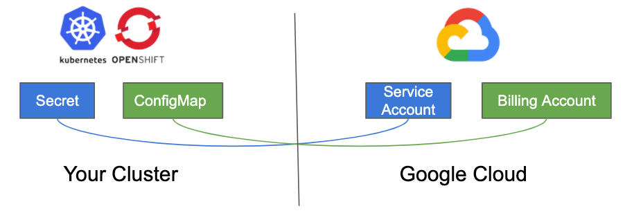

# GCP Configuration

The Operator requires specific GCP configuration to be present on your cluster.

> Note: Unless you're running this against your very own personal GCP org account, someone likely already has this stuff prepared for you in your company/team. Ask around.



### Configmap

The Operator needs to be aware of your Google GCP Billing account in order to manage your GCP Project programmatically.
If you don't have one, please [create](https://cloud.google.com/billing/docs/how-to/manage-billing-account) one and note its ID down.
For parent folder you can use any folder you like.
If you don't have one, feel free to [create](https://cloud.google.com/resource-manager/docs/creating-managing-folders) one.

You can create one example `ConfigMap` using the following command.

```zsh
cat <<EOF | kubectl apply -f -
apiVersion: v1
kind: ConfigMap
metadata:
  name: gcp-project-operator
  namespace: gcp-project-operator
data:
  data: |
    billingAccount: "123456-ABCDEF-123456" # Google billing ID from https://console.cloud.google.com/billing
    parentFolderID: "123456789123"         # Google Cloud organization Parent Folder ID
    ccsConsoleAccess:
    - example-group@xxx.com # A list of groups that will get access to CCS projects
EOF
```

### Secret

The Operator needs a [Google ServiceAccount](https://cloud.google.com/iam/docs/understanding-service-accounts) to authenticate its client against Google GCP.
Find your Google GCP SA by going [here](https://console.cloud.google.com/projectselector2/iam-admin/serviceaccounts?supportedpurview=project) or [create](https://cloud.google.com/iam/docs/creating-managing-service-accounts) one.
This downloads a `JSON` file with your key.

Add this information to your Kubernetes cluster by creating a `secret`:

```zsh
$ kubectl create -n gcp-project-operator secret generic gcp-project-operator-credentials --from-file=key.json=your-file.json
```

Now your Kubernetes cluster has everything it needs to build a client and communicate with Google GCP using your billing account and a ServiceAccount that has the permissions to create projects and other resources (such as virtual-machines).
